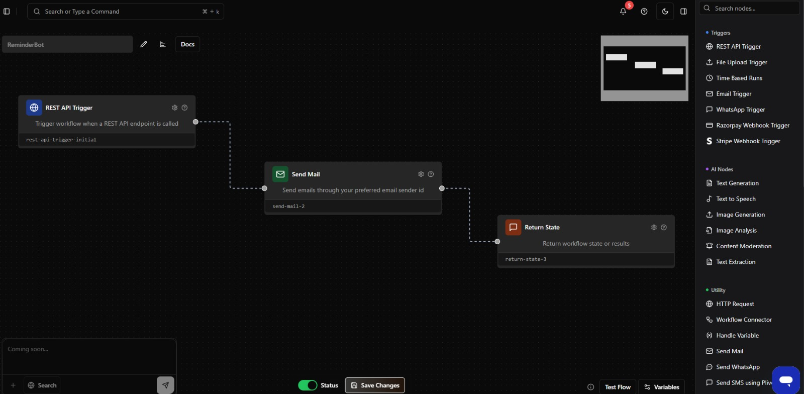
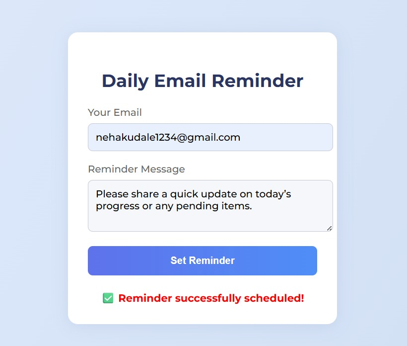
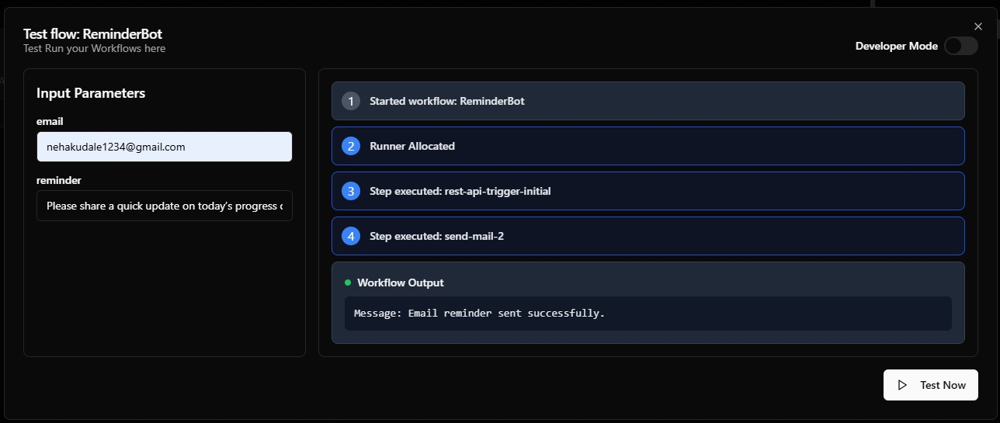
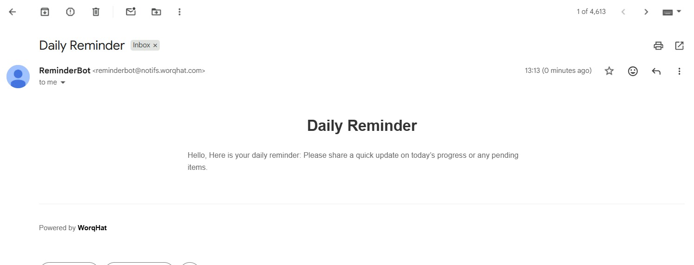

# Daily Reminder Bot  
🕒 An automated email reminder bot built with WorkHat to help users stay organized every day.

### 👩‍💻 Author / Team  
**Team Name:** SheBuilds  

---

## 🧩 Problem Statement  
Many individuals struggle to maintain consistency and productivity due to missed reminders or lack of motivation. Existing solutions are often complex, requiring manual setup, app installations, or multiple integrations.

---

## 💡 Solution  
A simple, automated **Daily Email Reminder System** built using **WorqHat** and a minimal **web frontend**.  
Users can enter their email and custom reminder message through a simple web page.  
The **backend workflow (WorqHat)** automatically sends a personalized email to the user every day at the scheduled time,  
helping them stay organized and never miss important tasks.

---

## 🚀 Features  
- ⏰ Time-based workflow triggers for scheduled daily reminders.  
- 🧾 Simple web form for user email and message input.  
- 🤖 WorqHat automation for sending personalized emails automatically.  
- 💬 Dynamic message insertion — users can set their own reminder messages.  
- ✅ Immediate confirmation through frontend and workflow status return.  
- 💻 Fully **no-code backend (WorqHat)** and lightweight **frontend (HTML/CSS/JS)**.  
- 🌐 Easily extensible for team, family, or group reminders.

---

## ⚙ Tech Stack  
- **Frontend:** HTML, CSS, JavaScript  
- **Backend Workflow:** WorqHat Platform  
- **Automation Type:** Email Reminder Automation  

---

## 🌈 How It Works  
1. User opens the web page and fills in their email and message.  
2. The data is sent to the **WorqHat workflow endpoint**.  
3. WorqHat automation triggers an **email reminder** at the set time daily.  
4. User receives an instant confirmation on screen and later the daily reminder email.

---

## 📸 Workflow Screenshots  

**1) WorqHat Workflow**  

**2) User Interface (UI)**  

**3) Test Flow – Workflow Execution**  

**4) Email Notification – Daily Reminder Received**  

---

## 🎥 Demo Video

  
   
  <em>🎬 Click the icon above to watch our project demo video on YouTube</em>

---

## 🧠 Future Enhancements  
- Add multiple reminder scheduling options.  
- Integrate with calendar APIs for smarter reminders.  
- Add motivational quotes or daily tips in the email body.  

---

## 🙌 Acknowledgment  
This project was created as part of the *Hackathon* challenge focusing on **AI Automation using WorqHat**.  
All backend automation has been implemented using the **WorqHat no-code platform**.

---

**Made with ❤ by Team SheBuilds**
